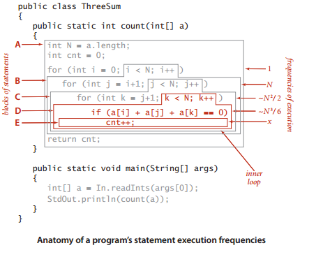
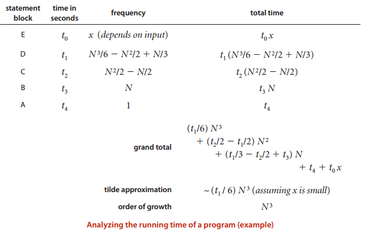

# Анализ алгоритмов

## Почему так важен анализ алгоритмов

Чтобы у пользователей или программистов не возникал вопрос "А почему моя программа так медленно работает?", будучи разработчиком, нужно уметь анализировать следующие важные вещи:
1. *Running time* алгоритма (математические модели) для разного размера наборов данных
2. *Memory usage* для алгоритмов и структур данных (языки программирования, операционная система)

Собственно, анализ времени выполнения алгоритмов и является наиболее главным в этом вопросе.

Причины анализировать алгоритмы:
1. Предсказывать эффективность
2. Сравнивать алгоритмы
3. Предоставлять гарантии
4. Понимать теоретический базис (теория алгоритмов)
Самая важная причина: избежать багов эффективности!!!

Методы анализа алгоритмов и их особенности:
- Научный метод:
  - математическая модель независима от конкретной системы
  - эмпирический анализ является необходимым для валидации математических моделей и чтобы делать предсказания
- Построение математической модели (мат. анализ):
  - анализируем алгоритм чтобы посчитать частоту операций
  - используем тильда нотацию чтобы упростить анализ
  - модель позволяет нам *объяснять поведение*
- Эмпирический анализ: 
  - запустили программу на разных по размеру инпутах и засекли время
  - Предполагаем степенной закон и формулируем гипотезу для running time
  - модель позволяет нам *делать предсказания*

## Научный метод

Научный метод:
1. Наблюдение некоторых признаков естественного мира, как правило с точными измерениями.
2. Формулирование гипотезы - модели, которая согласуется с наблюдениями.
3. Прогнозирование - предсказывать события используя гипотезу.
4. Верификация - проверить предсказания сделав дальнейшие наблюдения.
5. Валидация - повторяем пока гипотеза и наблюдения не согласуются.

На алгоритмах:
1. Эмпирический анализ: наблюдение.
2. Анализ данных (формулируется гипотеза): используется регрессионный анализ и строится прямая вида `T(N) = a N^b` (*power law*), где `b` - *slope*.
Гипотеза будет выглядеть, например, так: 
> The running time is about `1.006 × 10^–10 × N^2.999` seconds. 
Причем порядок роста функции будет `N^3` (смотрим на последний множитель). 
3. Прогнозирование и валидация: подставляем в формулу `N` и получаем время.
4. Гипотеза удвоения: проще просто удвоить инпут в размере и получить `b`.

## Математический анализ

*Total running time* программы определяется двумя факторами:
- Стоимостью выполнения каждого оператора (*statement*)
- Частотой выполнения каждого оператора.

Термины, которые нужны для выполнения мат. анализа: тильда аппроксимация (*tilde approximation*), порядок роста (*order of growth*), модель стоимости (*cost model*).

### Тильда аппроксимация

Тильда аппроксимация (*tilde* ~) или аппроксимация по лидирующему терму: откидываются термы низкого порядка, которые усложняют формулу и отображают пренебрежимо малый вклад в значения, представляющие интерес. 
*Definition*. Мы пишем `~ f(N)` чтобы показать любую функцию, которая при делении на `f(N)`, приближается к `1` когда `N` растет, и мы пишем `g(N) ~ f(N)` чтобы указать, что `g(N) / f(N)` приближается к `1` когда `N` растет.

Пример: `N^3/6 - N^2/2 + N/3 ∼ N^3/6`. Здесь `∼ N^3/6` называется тильда аппроксимацией. Забегая вперед, в этом примере можно получить и порядок роста `N^3` (отбрасывается и константа).

Большую часть времени мы работаем с тильда аппроксимацией в форме
`g(N) ∼ a f(N)`, где `f(N) = N^b (log N)^c`  с `a`,`b` и `c` константами, а `f(N)` -  порядок роста `g(N)`.

Другие нотации: Big Theta, Big Oh, Big Omega. См. ниже, Теорию алгоритмов.

> Частая ошибка - интерпретировать Big Oh как апроксимирующую модель

> В курсе *Coursera Algorithms: Part 1-2* используется *Tilde-notation*

### Гипотеза порядка роста

*Property*. Порядок роста времени выполнения ThreeSum (чтобы вычислить число троек, которые суммируют числа от *0* до *N*) есть *N^3*.

> Property - это терм, ссылающийся к гипотезе, которую нужно проверить (валидировать) через эксперимент.

*Evidence*: Пусть *T(N)* будет временем выполнения ThreeSum для *N* чисел. Только что описанная математическая модель предполагает, что *T(N) ~ a N^3* для некоторой машинно-зависимой константы *а*; эксперименты на многих компьютерах валидируют эту аппроксимацию. 

Рассмотрим пример ThreeSum. Найдем частоты выполнения блоков операторов:

То есть if оператор выполняется точно `N (N - 1) (N - 2) / 6` раз (число путей подобрать `3` разных числа из *input array*). `6` потому что `3! = 1 * 2 * 3`. 

Анализ времени выполнения будет следующим:

Порядок роста позволяет нам разделить программную реализацию от алгоритма. Алгоритм определяет порядок роста. Разделение алгоритма от реализации позволяет нам разрабатывать знания о производительности алгоритма и затем применять это знание к любому компьютеру.

#### Модель стоимости

Модель стоимости определяет стандартные операции, используемые алгоритмом, который мы изучаем. Для проблемы ThreeSum моделью стоимости будет *количество доступов к массиву*: `a[i] + a[j] + a[k]`. С помощью этой модели стоимости мы можем делать точные математические выражения о свойствах алгоритма, не только о конкретной реализации.

Наша цель: находить модели стоимости, такие что порядок роста времени выполнения для данной реализации такой же как и порядок роста стоимости нижележащего алгоритма (другими словами,  модель стоимости должна включать операции в *inner loop*). 

#### Выводы. Нахождение математической модели *running time*

Для многих программ, разрабатывание мат. модели running time разделяется на такие шаги:
1.	Разработать *input model*, включая определение проблемы размера
2.	Найти *inner loop*
3.	Определить *cost model*, которая включает операции в *inner loop*.
4.	Определить частоту выполнения операций для данного *inputа*. Используя математический анализ, показать порядок роста.

Пример "Бинарный поиск": 
- *input model* - это массив `a[]` размера `N`;
- *inner loop* это операторы в одиночном `while` цикле
- *cost model* - это операция сравнения (сравнение значений двух энтрисов массива)
- анализ показывает, что число сравнений не более чем `lg N + 1`

> При исследовании могут быть полезны различные аппроксимации. Например, 1 + 1 + 1 + … + 1 = lg N. См. папку Images.

# Теория алгоритмов

Типы анализа:
- Best case - lower bound по стоимости (чтобы разработать lower bound нужен `Ω(N)`) 
  - определяется по "простому" инпуту 
  - предоставляет цель для всех инпутов  
- Worst case - upper bound по стоимости (чтобы разработать upper bound нужен `O(N)`)
  - определяется по "самому тяжелому" инпуту
  - предоставляет гарантию для всех инпутов 
- Average case - "ожидаемая" стоимость
  - нужна модель "рандомного" инпута
  - предоставляет способ предсказывать производительность  
  
Ex 1. Доступы к массиву для brute-force ThreeSum:

Type | Tilde approximation
--- | --- 
Best | `~ 1/2N^3`
Average | `~ 1/2N^3`
Worst  | `~ 1/2N^3`

Ex 2. Сравнения для бинарного поиска:

Type | Tilde approximation
--- | --- 
Best | `~ 1`
Average | `~ lg N`
Worst  | `~ lg N`

Дополнительные заметки:
- Асимптотический порядок роста `Θ(N)` нужен для классификации алгоритмов.
- Оптимальный алгоритм гарантирует, что lower bound ~ upper bound. 
- Для анализа алгоритмов лучше использовать "тильда нотацию" (~) для предоставления приблизительных моделей (*approximate models*).  Зачем она? Ну она лучше описывает функцию. Предоставляет как upper bound так и lower bound

> В Инете я нашел ответ на вопрос про разницу ~ и O. Есть 2 разницы между ними:
> - O предоставляет upper bound, а ~ - и upper bound, и lower bound. Другая нотация с такими же свойствами, что и ~ - это Θ.
> - O поддерживает только константу: f=O(g) если f(n)≤Cg(n) для некоторой константы C>0 (и достаточно большой n). С другой стороны для ~ указанная константа всегда 1: если f~g тогда f/g->1. Это контрастирует с Θ, в которой константа произвольная (arbitrary) и в самом деле могут быть разные константы для lower и upper bounds.
> Точные константы в целом непрактичны по многим причинам: они зависят от машины, трудны для вычисления и могут колебаться в зависимости от n. Первая проблема может быть смягчена путем измерения некоторого приближения фактической сложности времени, например, количества сравнений в алгоритме сортировки (модель стоимости?).
Кажется, что в курсе они используют Θ, но называют его порядком роста.

##### Пример ThreeSum

Цель: установить "сложность" задачи и разработать "оптимальные" алгоритмы.

Upper bound. Специфический алгоритм:
- Например, *Улучшенный* алгоритм для ThreeSum
- Running time оптимального алгоритма для ThreeSum является `O(N^2 log N)`

Lower Bound. Доказательство того, что ни один алгоритм не может делать это лучше.
- Например, мы должны проверить все `N` энтрис чтобы решить ThreeSum
- Running time оптимального алгоритма для решения ThreeSum будет `Ω(N)`.

Открытые проблемы (TODO: проверить на актуальность):
- есть оптимальный алгоритм для ThreeSum?
- *Subquadratic* алгоритм для ThreeSum?
- Квадратичный lower bound для ThreeSum?
